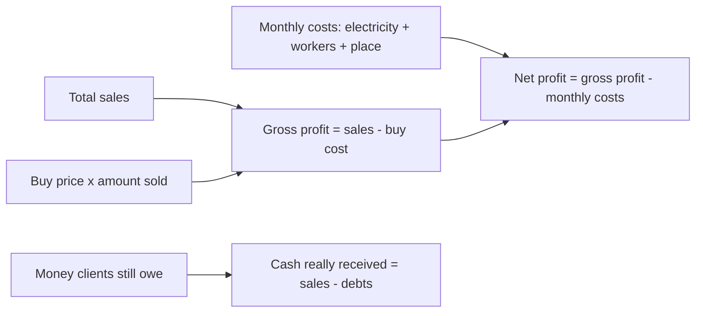
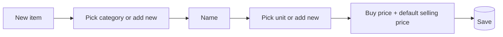
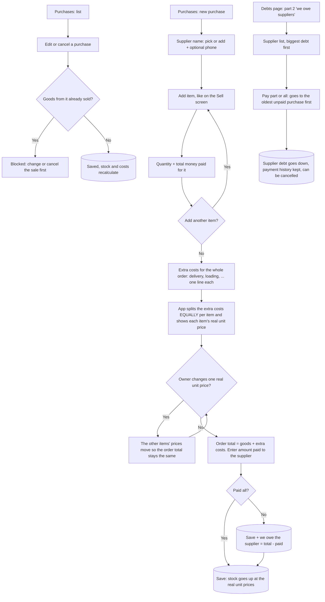
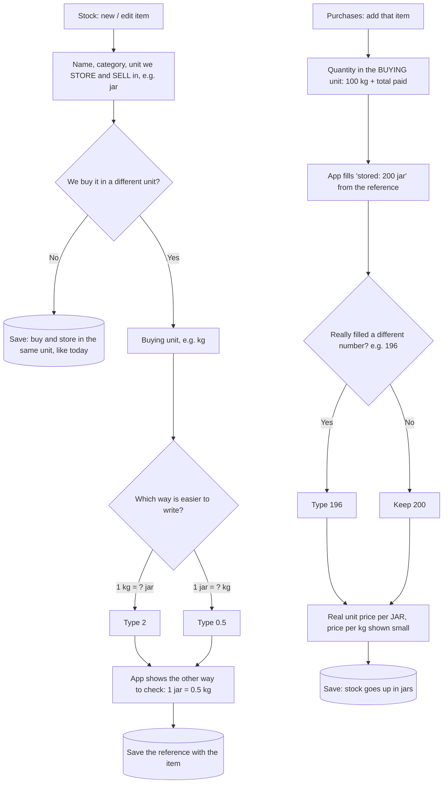
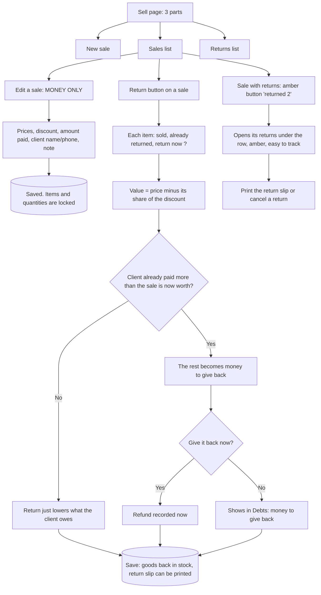

# Olive Storage — App Flow (draft v1, for owner review)

Renders as a diagram on GitHub and in most Markdown viewers.

## 1. Main flow

## 2. How the numbers are calculated (so nothing is checked by hand)

## 3. Data (what SQLite will hold)

| Table | Holds |
|---|---|
| items | name, unit, buy price, default selling price |
| stock_in | item, amount received, buy price at that time, date |
| clients | name, phone (optional) |
| sales | client, date, total, paid, remaining debt |
| sale_lines | sale, item, amount, selling price used, buy price at that time |
| payments | sale or client, amount, date (debt payments) |
| expenses | month, type (electricity / workers / place), amount, note |
| settings | owner PIN (hashed) |

Stock on hand is never typed in directly. It is always `stock_in - sold`, so it can't drift out of sync over the years.

## 4. Decisions (answered by owner)
1. Buy price changes per delivery. Each delivery stores its own price; the app uses it for profit.
2. Workers: one total per month.
3. Currency: IQD only (whole numbers, no decimals).
4. Dashboard lock: PIN.
5. Sales (and stock entries, debt payments, costs) can be edited or cancelled at any time. Stock, debts and profit recalculate automatically. Every change is kept in a history log so nothing is lost.
6. Languages: Kurdish (Sorani) and Arabic only. The app is right-to-left, with a language switch.

7. Units are user-defined: the owner adds his own units (kg, box, ...) in Settings and picks one per item.
8. Categories are user-defined and permanent. Each item belongs to one category (e.g. Olives, Oil, Jars). Categories show as chips/tabs in Stock and Sell, and combine with search.
9. Default language: Kurdish (Sorani).

### Item entry with categories

### Finding items fast (Stock and Sell screens)
Category chips on top, then a search box, then recently sold items first. Search matches the item name inside the chosen category.

## 5. Still open
- Nothing blocking. UI mockups are next.

## 6. Purchases — buying goods (owner request 2026-10-09, approved and built the same day)

Goods no longer come in from the Stock page. They come in through a new **Purchases (کڕین)** section that works like Sell, but for buying. Stock keeps items, categories, units, what is on hand and the cost.

### How the real unit price is calculated
- Each item: real cost = what was paid for it + its share of the extra costs; real unit price = real cost / quantity.
- The extra costs are split **equally per item line** (3 items, 60,000 delivery = 20,000 each).
- If the owner types a different real unit price for one item, that item is fixed at that price and the remaining items share the rest equally, so **goods + extra costs always add up to the order total**. A "back to equal" button undoes it. Changing that item's quantity or paid amount afterwards puts it back to automatic (the typed price was for the old numbers). With only one item, its price cannot be typed: it carries all the extra costs.
- The real unit price becomes the item's cost: it is used for profit (each sale keeps the cost it had when it was sold), stock value and the Dashboard.
- Example: olives 100 kg paid 500,000, oil 20 L paid 760,000, pickles 30 boxes paid 90,000, delivery 40,000 + loading 20,000. Each item gets 20,000: olives 5,200 / kg, oil 39,000 / L, pickles 3,667 / box. Total 1,410,000.

### Suppliers
- Name (suggests earlier names) + optional phone number. The name may stay empty only when the purchase is paid in full.
- We owe the supplier = **order total (goods + extra costs) − paid**. Later payments go to the oldest unpaid purchase first, like client debts.
- Debts page: part 1 "clients owe us" (as today), part 2 "we owe suppliers" (pay button, payment history, cancel a payment).
- Dashboard: a "we owe suppliers" figure next to "clients owe us".

### Cancelling a purchase
- Allowed only while its goods are not sold (same rule as today's deliveries).
- If money was already paid to the supplier, it shows as "the supplier must return" (like refunds to clients) until recorded.

### Old data
- Deliveries entered before this change stay exactly as they are (stock and costs do not change). They show in an item's history as "old delivery".

## 7. Buying unit vs storing unit (owner request 2026-10-09, approved and built the same day)

Some goods are bought in one unit and stored/sold in another: 100 kg of olives fill 200 jars, 1 box = 12 jars, 1 sack = 50 kg. Each item can remember that reference, and Purchases uses it.

### Rules
- The switch is off for every existing item, so nothing changes for goods bought and sold the same way.
- The reference can be a decimal (1 kg = 1.5 jar) and is written whichever way the owner prefers per item; the app always shows the reverse too.
- In a purchase, the quantity is typed in the buying unit; the stored amount is pre-filled (quantity x reference) and can be corrected. If the quantity changes, the stored amount is filled again from the reference.
- The real unit price (and profit, stock value, selling) is per STORE unit (jar); the price per buying unit (kg) is shown small underneath. Extra costs are still split per item line exactly as in section 6.
- Changing an item's reference later does not change purchases already saved: each purchase keeps what was bought (100 kg) and what was stored (196 jar).
- Empty jars: add them as an extra cost line in the purchase (e.g. "jars 30,000"); no separate stock for empty jars.
- Stock, Sell, Debts and the Dashboard keep showing the store unit (jar), so selling does not change.

## 8. Returns of sold goods (owner request 2026-10-10, approved and built the same day)

A saved sale is never changed in its items or quantities any more. Goods that come back are recorded as a **return** on that sale, so the original invoice stays exactly as it was printed.

### Rules
- The invoice PDF keeps the original items; under them a "returned items" part lists every return (date, item, quantity, amount), then: original total, returned -X, net total, paid, debt.
- Return slip PDF ("گەڕاندنەوەی کاڵا" / "مرتجع"): return number, date, client + phone, invoice number, the returned items, total value, money given back now (if any), two signature lines, the same footer as every paper.
- A return can never take back more than was sold minus what was already returned.
- Value of a returned item = quantity x its price, minus its share of the sale's discount (10% off -> a 10,000 item comes back as 9,000).
- Stock goes up by the returned quantity. Profit: the returned sale and its cost come off the Dashboard in the month of the return.
- A return can be cancelled (it comes back as sold) only if that stock is still there.
- Cancelling a whole sale still works as today; its returns then no longer count.
