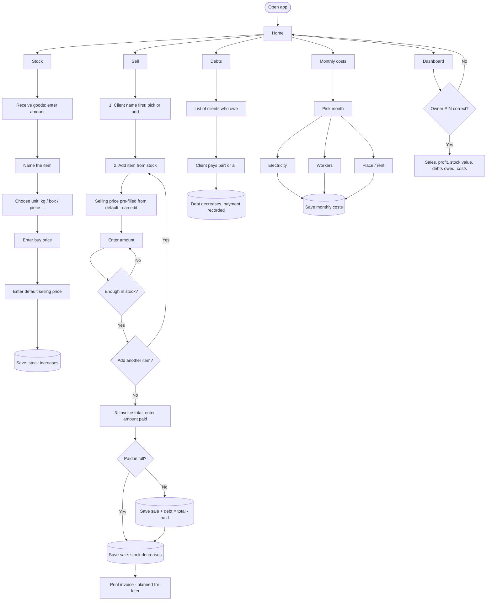
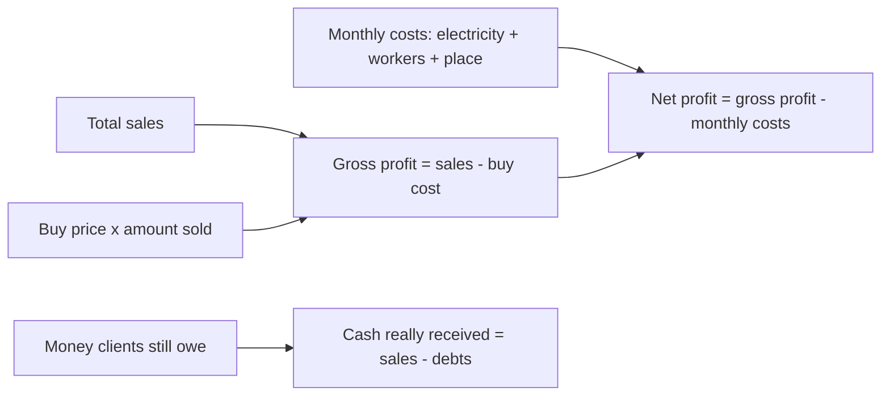
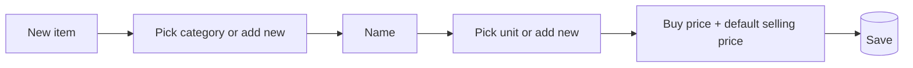

# Olive Storage — App Flow (draft v1, for owner review)

Renders as a diagram on GitHub and in most Markdown viewers.

## 1. Main flow

## 2. How the numbers are calculated (so nothing is checked by hand)

## 3. Data (what SQLite will hold)

| Table | Holds |
|---|---|
| items | name, unit, buy price, default selling price |
| stock_in | item, amount received, buy price at that time, date |
| clients | name, phone (optional) |
| sales | client, date, total, paid, remaining debt |
| sale_lines | sale, item, amount, selling price used, buy price at that time |
| payments | sale or client, amount, date (debt payments) |
| expenses | month, type (electricity / workers / place), amount, note |
| settings | owner PIN (hashed) |

Stock on hand is never typed in directly. It is always `stock_in - sold`, so it can't drift out of sync over the years.

## 4. Decisions (answered by owner)
1. Buy price changes per delivery. Each delivery stores its own price; the app uses it for profit.
2. Workers: one total per month.
3. Currency: IQD only (whole numbers, no decimals).
4. Dashboard lock: PIN.
5. Sales (and stock entries, debt payments, costs) can be edited or cancelled at any time. Stock, debts and profit recalculate automatically. Every change is kept in a history log so nothing is lost.
6. Languages: Kurdish (Sorani) and Arabic only. The app is right-to-left, with a language switch.

7. Units are user-defined: the owner adds his own units (kg, box, ...) in Settings and picks one per item.
8. Categories are user-defined and permanent. Each item belongs to one category (e.g. Olives, Oil, Jars). Categories show as chips/tabs in Stock and Sell, and combine with search.
9. Default language: Kurdish (Sorani).

### Item entry with categories

### Finding items fast (Stock and Sell screens)
Category chips on top, then a search box, then recently sold items first. Search matches the item name inside the chosen category.

## 5. Still open
- Nothing blocking. UI mockups are next.
